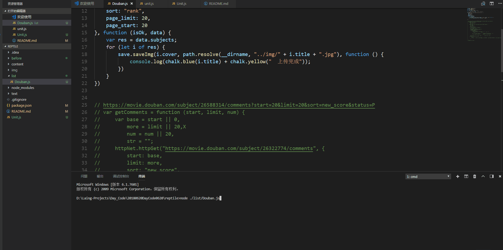

# reptile


爬虫的一些初涉

### 说明
<p style="border-bottom: 1px solid #eaecef"></p>

主要用``Node``来进行的爬虫操作

### Core Code(关键代码)
仓库的代码主要在``Unit.js``

#### 第一版的封装

<b>关于http</b>
* 引入request模块进行对请求进行封装
* 对``get``和``POST``的请求方式进行再一次的封装
* 使用
    ```javascript
        const { http, save } = require("../Unit"); // 引入Unit.js
        http.httpGet("https://movie.douban.com/j/search_subjects", {
            type: "movie",
            tag: "豆瓣高分",
            sort: "rank",
            page_limit: 20,
            page_start: 20
        }, function (isOk, data) { // 方法的回调
            console.log(isOk);
        })
    ```
<b>关于保存数据</b>
 * 保存图片到本地
 * 保存文字到本地
 * 使用
    ```javascript
        const { http, save } = require("../Unit");
        save.saveImg(这里是传的图片的流文件, 图片的位置及命名,回调函数)
    ```
<b>完整示例</b>
```javascript
    const path = require("path");
    http.httpGet("https://movie.douban.com/j/search_subjects", { // 这是一个接口
        type: "movie",
        tag: "豆瓣高分",
        sort: "rank",
        page_limit: 20,
        page_start: 20
    }, function (isOk, data) {
        console.log(isOk);
        var res = data.subjects;
        for (let i of res) {
            save.saveImg(i.cover, path.resolve(__dirname, "../img/" + i.title + ".jpg"), i.title + "上传完成")
        }
    })
```
<b>动图展示</b>
</img>


